<!-- HEADER BANNER -->

  

<!-- TYPING EFFECT SUBHEAD -->

  

---

### 🚀 Currently Working On
A snapshot of what I'm designing and deploying right now:

*   **[Project Name 1]** - A high-performance database engine utilizing asynchronous I/O (`io_uring`) and custom B+ Tree indexing.
*   **[Project Name 2]** - Distributed orchestration telemetry targeting low-latency message queues.
*   **[Project Name 3]** - Embedded IoT processing boards using digital signal processing modules.
*   **[Project Name 4]** - File Forensics: File recovery/ Hard Drive recovery software
*   **[Project Name 5]** - CDC - (Change data Capture) - An ETL tool that triggers downstream services when data in a database changes

---

### 🛠️ Tech Stack & Ecosystem

  <!-- Languages -->
  
  
  
  
  <!-- DevOps & Infrastructure -->
  
  
  
  

---

### 📊 GitHub Metrics & Consistency

  
  

---

### ✍️ Recent Engineering Insights
I periodically write in-depth articles on Systems Engineering, Low-Level performance optimizations, and Distributed Systems. Here are my latest posts:

* [Demystifying C++20 Coroutines: Low-Level Stack-to-Heap Mechanics](https://prime-tech-blitz.hashnode.dev/c-coroutine-design) - A deep dive into RAII-native coroutine handles, exploring the move constructor "baton pass" trick that prevents premature heap destruction.

* [Hardware Demystified: How the MMU and TLB Translate Your Code's Memory](https://prime-tech-blitz.hashnode.dev/hardware-demystified-how-the-mmu-and-tlb-translate-your-code-s-memory) - An insight into memory access pipeline, using TLB to save time and the data structures involved in bookkeepping of memory access

* [Virtual Memory, TLB Bottlenecks, and the Case for HugePages](https://prime-tech-blitz.hashnode.dev/virtual-memory-tlb-bottlenecks-and-the-case-for-hugepages) - A deep dive into the bottlenecks caused by TLBs, and arguing out a case for Hugepages.

* [How Go's sync.Pool Lowers Garbage Collection Churn](https://prime-tech-blitz.hashnode.dev/how-go-s-sync-pool-lowers-garbage-collection-churn) - A deep dive into Go's Garbage Collector and memory sync pools to efficiently reuse objects.

---

  

---

### 🌐 Let's Connect
Feel free to reach out via any of the channels below to talk systems architecture, infrastructure, or open-source engineering:

  
  
  

